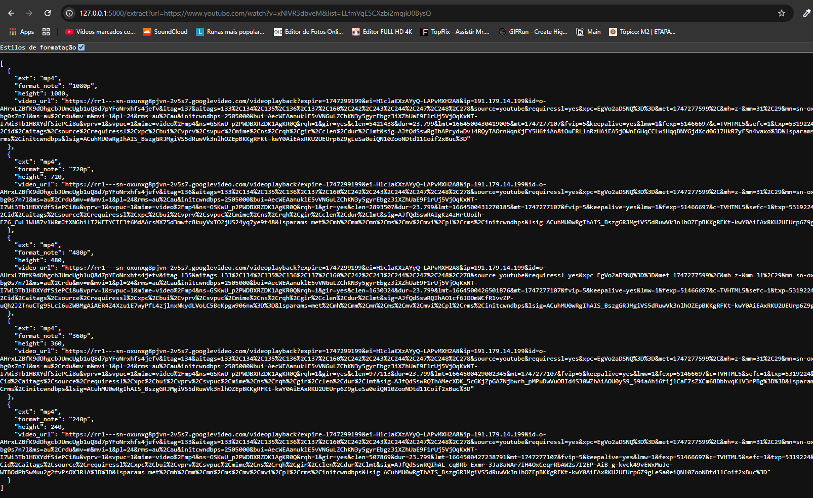
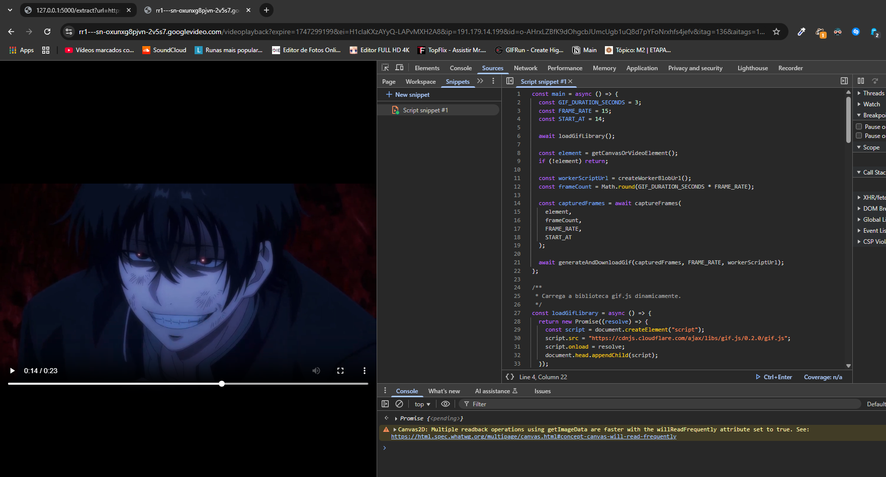

# 🎞️ Snippet para Captura de Canvas/Video e Conversão em GIF

Este projeto contém um **snippet JavaScript** que pode ser injetado diretamente em páginas da web para capturar animações de elementos `<canvas>` ou `<video>` e gerar um **arquivo GIF** com base em configurações personalizadas do usuário.

---

## 🚀 Como Funciona

- O script identifica e captura o conteúdo da tag `<canvas>` ou `<video>` presente na página.
- Ele coleta múltiplos frames ao longo de um intervalo configurável, definido por:

  - `GIF_DURATION_SECONDS`: duração total da gravação (em segundos)
  - `FRAME_RATE`: número de quadros por segundo (FPS)
  - `START_AT`: tempo (em segundos) no qual a gravação deve começar

- A biblioteca [**gif.js**](https://jnordberg.github.io/gif.js/) é carregada dinamicamente para compilar os frames e gerar um arquivo `.gif` no navegador.

📌 **Recomendação**: para melhor equilíbrio entre qualidade e desempenho, mantenha `FRAME_RATE` em **20 FPS**.

---

## 🧪 Testando o Snippet

Foi utilizada a biblioteca `yt-dlp` para obter links diretos de vídeos do YouTube no formato `.mp4`. Com o vídeo carregado em uma página, o snippet é executado diretamente no console do navegador para capturar e gerar o GIF.

### ✅ Exemplo de Uso

1. **Captura do link via yt-dlp**

   

2. **Execução do snippet no navegador**

   

3. **GIF gerado automaticamente**

   
